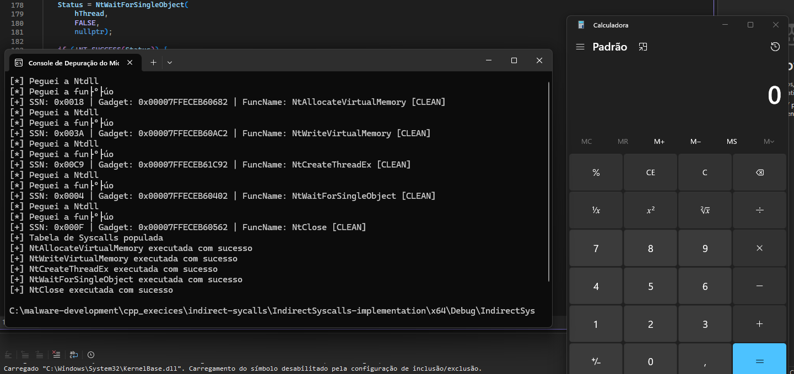

# MyIndirectSyscallsImplementation
Minha implementação da técnica Indirect Syscalls usando o princípio de execução de funções Nt na técnica Hell's Gate.

## Sobre a técnica

A técnica chamada de "Indirect Syscalls" é uma evolução da técnica Direct Sycalls. Nessa implementação, utilizei os mesmos princípios das técnicas Hell's Gate e Halo's Gate (amplamente vistas em Direct Syscalls) para localizar o SSN (System Service Number) e o gadget (0x0F, 0x0E, 0xC3) do stub da função Nt.

## Estrutura do projeto

Dentre os arquivos presentes no repositório, os códigos estão estruturados dessa maneira:

```text
IndirectSyscalls-implementation
    ├── peb_walking.cpp 
    ├── helper.h 
    ├── resolve_syscalls.cpp 
    ├── stub.asm
    ├── globals.cpp
    └── main.cpp 
```
No arquivo peb_walking.cpp, está a implementação de duas funções, a GetNtdllBase e GetModuleHandlePeb. A primeira, procura o módulo ntdll.dll e a segunda procura as funções dentro desse módulo.

No arquivo helper.h, está a definição de todas as funções, macros e structs que são utilizadas nos demais arquivos

No arquivo resolve_syscalls.cpp, está a implementação das funções que verificam se o stub está limpo, que recuperam os SSNs e os gadgets, populando a struct das syscalls logo em seguida.

No arquivo globals.cpp, está a declaração das variáveis globais que vão ser utilizadas pelo stub.asm.

No arquivo stub.asm está o stub assembly que será usado para executar as funções Nt via Indirect Syscalls.

No main.cpp está a declarações das funções Nt e suas chamadas no estilo da técnica Hell's Gate (MeowGate e MeowDescent). As funções Nt utilizadas executam uma injeção de código (shellcode) no próprio processo (GetCurrentProcess( ) ) clássica. (NtAllocateVirtualMemory + NtWriteVirtualMemory + NtCreateThreadEx + NtWaitForSingleObject + NtClose)

## POC



## Link do meu blog:

https://kittens-den.gitbook.io/kittens-den
